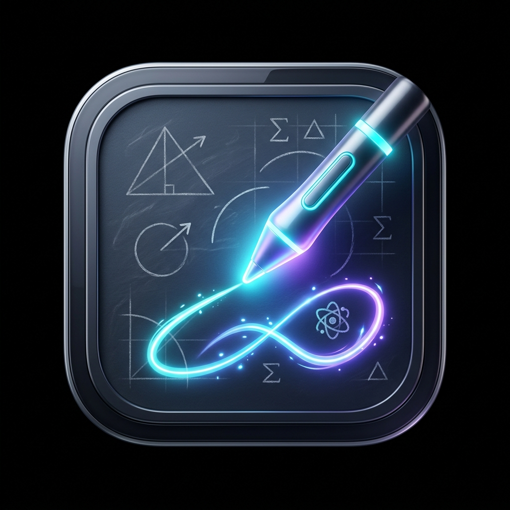

# 🎓 Professor Screen Share

<div align="center">
  

  <h3>Espelhamento de Tela, Recorte Dinâmico e Anotações Interativas para Aulas e Apresentações</h3>

  <p align="center">
    
    
    
    
    
    
  </p>
</div>

---

## 📖 Sobre o Projeto

O **Professor Screen Share** é uma aplicação desktop desenvolvida especialmente para professores, instrutores e palestrantes que necessitam compartilhar telas, janelas ou áreas específicas do computador com um segundo monitor, projetor ou diretamente com os dispositivos dos alunos conectados à rede local (Wi-Fi/LAN).

Com foco em fluidez e baixa latência, o sistema combina a captura de vídeo nativa com ferramentas de desenho em tempo real, recorte estilo "Sniper" e um servidor web integrado com sala de espera e controle de acesso.

---

## ✨ Principais Funcionalidades

### 🖥️ 1. Captura de Fontes em Tempo Real (60 FPS)
- **Telas e Monitores**: Captura de monitores físicos completos com aceleração de hardware.
- **Janelas Individuais**: Captura de janelas específicas de programas abertos (navegadores, IDEs, editores, etc.).
- **Miniatura em Tempo Real**: Pré-visualização da fonte antes de transmitir.

### 🎯 2. Modo Sniper (Recorte de Área Arbitrária)
- Selecione livremente qualquer retângulo na tela para transmitir apenas o que interessa.
- **Ajuste de Transparência**: Controle de 10% a 95% para não perder a visibilidade do conteúdo durante a seleção.
- **Sincronização Multi-Monitor**: Suporte a recorte em qualquer monitor físico conectado.
- Botão de reset rápido para restaurar tela cheia a qualquer momento.

### 🎨 3. Lousa e Anotações Interativas
- Desenhe em tempo real sobre a transmissão na janela do Visualizador.
- **Ferramentas Disponíveis**:
  - ↗️ **Seta**: Indicação precisa de pontos importantes.
  - ⬜ **Retângulo**: Enquadramento de blocos e trechos de código.
  - ⭕ **Círculo**: Destaque de elementos circulares e itens de foco.
  - ✏️ **Caneta Livre**: Desenhos à mão livre e anotações rápidas.
  - 🖍️ **Marca-texto**: Traço translúcido para realçar textos e imagens.
  - 🔤 **Texto**: Inserção de texto diretamente sobre o vídeo.
- Paleta de cores rápida e seletor RGB personalizado.
- Controle dinâmico de espessura do traço e histórico de desfazer (`Ctrl+Z`).

### 🌐 4. Screen Shared Web (Transmissão Local para Alunos)
- Servidor HTTP e WebSocket embutido rodando diretamente na máquina do professor.
- Acesso fácil de alunos e participantes via navegador (computador, tablet ou celular) em `http://<IP-DO-PROFESSOR>:3000/screen_shared`.
- **Sala de Espera e Segurança**: O professor aprova, recusa ou desconecta participantes individualmente no painel de controle.
- **Controles no Navegador**: Os alunos contam com zoom (até 500%), movimentação panorâmica (*pan mode*) e modo tela cheia.

### 🪟 5. Visualizador Dedicado para 2º Monitor / Projetor
- Envio da janela do visualizador para qualquer monitor com um clique.
- Atalho `F11` para alternar rapidamente entre janela e tela cheia sem bordas.
- Barra de ferramentas retrátil com auto-hide para não poluir a apresentação.

### 🎨 6. Design Moderno e Uniforme
- Fundo escuro profundo com iluminação ambiente suave (*ambient glow*).
- Barra de título customizada e integrada com botões estilizados de minimizar, maximizar e fechar.
- Ícone personalizado no estilo lousa escolar digital com caneta luminosa.

---

## ⌨️ Atalhos de Teclado

| Atalho | Descrição |
| :--- | :--- |
| `F11` | Alternar modo Tela Cheia no Visualizador |
| `Ctrl + Z` | Desfazer a última anotação desenhada |
| `Esc` | Cancelar seleção do modo Sniper ou fechar caixa de texto |
| `Scroll do Mouse` | Aumentar/diminuir zoom na tela de transmissão web |

---

## 🛠️ Tecnologias Utilizadas

- **Framework Desktop**: [Electron](https://www.electronjs.org/)
- **Frontend**: [React 18](https://react.dev/) + [TypeScript](https://www.typescriptlang.org/)
- **Build Tool**: [electron-vite](https://electron-vite.org/) + [Vite 6](https://vitejs.dev/)
- **Estilização**: [Tailwind CSS](https://tailwindcss.com/)
- **Ícones**: [Lucide React](https://lucide.dev/)
- **Comunicação Web**: [WebSocket (ws)](https://github.com/websockets/ws)
- **Testes Unitários**: [Vitest](https://vitest.dev/) + [React Testing Library](https://testing-library.com/)

---

## 🚀 Como Executar o Projeto

### Pré-requisitos
- [Node.js](https://nodejs.org/) (versão 18 ou superior)
- [npm](https://www.npmjs.com/)

### Instalação
```bash
# Clone o repositório
git clone https://github.com/AlysonDEV/professor_screen_share.git

# Acesse a pasta do projeto
cd professor_screen_share

# Instale as dependências
npm install
```

### Execução em Modo de Desenvolvimento
```bash
npm run dev
```

### Verificação de Tipos e Testes
```bash
# Checagem de tipos TypeScript
npm run typecheck

# Execução dos testes unitários
npm test
```

---

## 📦 Como Gerar o Instalador Windows (`.exe`)

Para empacotar a aplicação em um instalador oficial para Windows:

```bash
# 1. Compilar os pacotes da aplicação
npm run build

# 2. Gerar o instalador com o electron-builder
npx electron-builder --win
```

O instalador executável será criado dentro da pasta `dist/` (ex: `Professor Screen Share Setup 1.0.1.exe`).

---

## 📁 Estrutura de Pastas

```text
professor-screen-share/
├── resources/           # Ícones e assets nativos da aplicação
├── src/
│   ├── main/           # Processo Principal do Electron
│   │   ├── services/   # Servidor web local (HTTP & WebSocket)
│   │   ├── utils/      # Logger, caminhos de ícone e preload
│   │   └── windows/    # Gerenciadores de janelas (Menu, Sniper, Viewer)
│   ├── preload/        # Scripts de Preload e Bridge IPC
│   ├── renderer/       # Interfaces React
│   │   └── src/
│   │       ├── assets/ # Estilos CSS globais e ícones
│   │       ├── control/# Tela de Menu e Painel de Controle
│   │       ├── sniper/ # Tela de seleção e recorte
│   │       └── viewer/ # Tela do visualizador de alta resolução
│   └── shared/         # Tipos TypeScript e constantes de eventos IPC
├── package.json
└── tailwind.config.ts
```

---

## 📄 Licença

Este projeto é desenvolvido para fins educacionais e de demonstração. Distribuído sob a licença [MIT](LICENSE).
